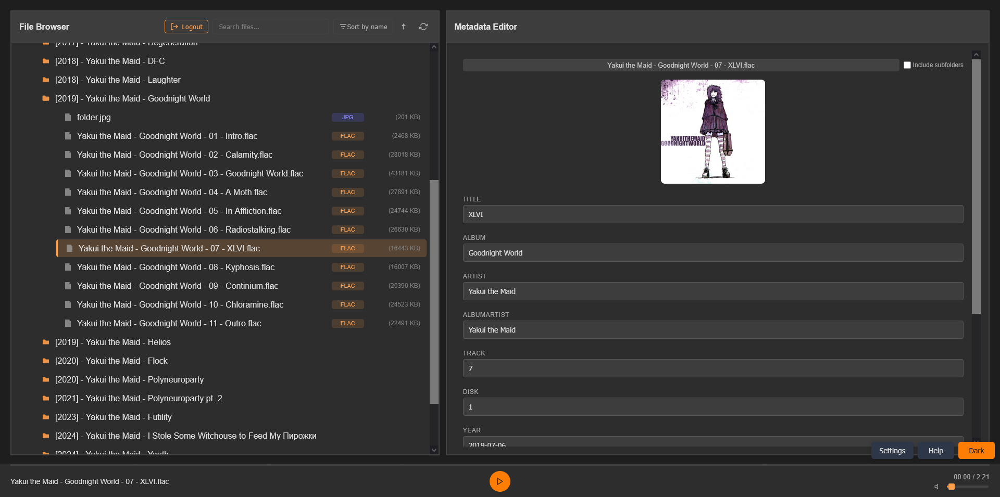
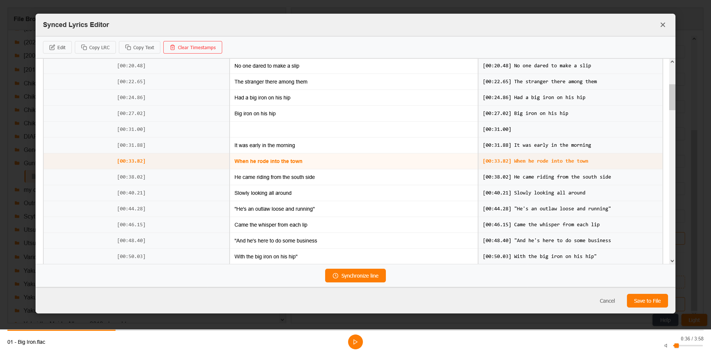
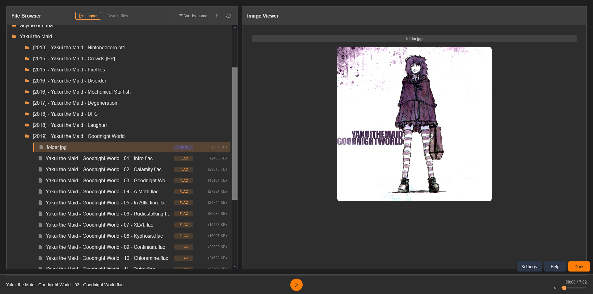
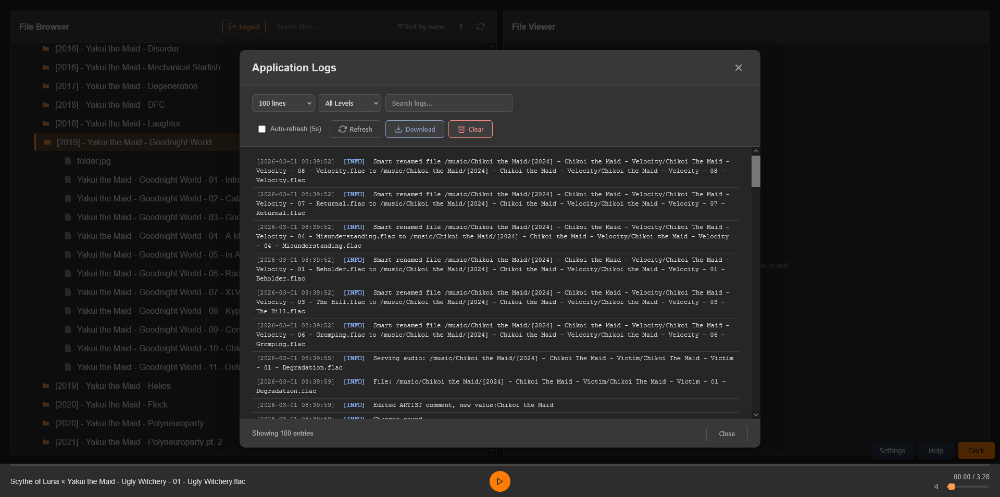
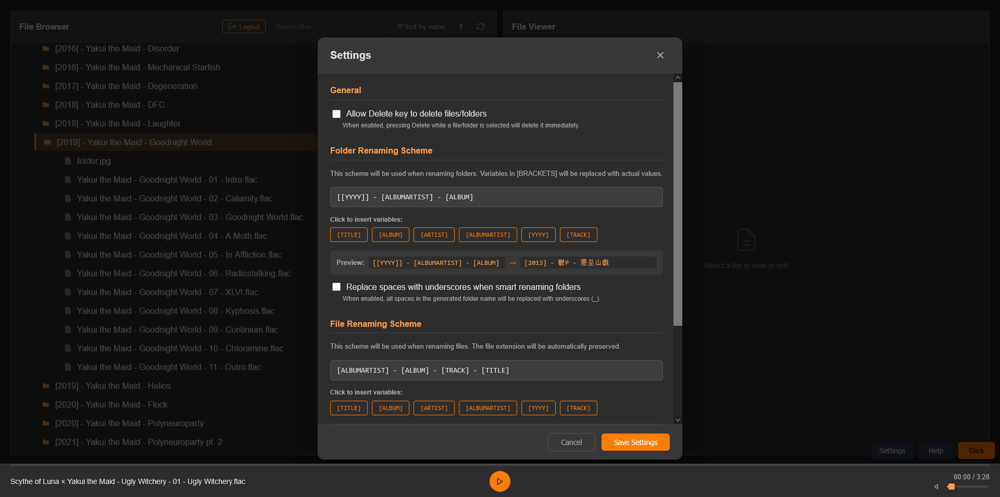
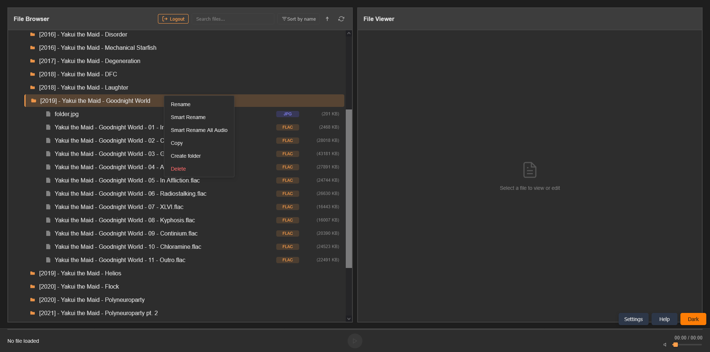

# metadata-docker

A self-hosted web application for editing audio file metadata (FLAC/MP3) and managing audio library with a built-in audio player, synchronized lyrics editor, and file browser. Personal project that started as a way to manage Navidrome library.



App could be useful to anyone selfhosting their own music streaming service like Navidrome or anyone with a large audio library to manage.

## Features
- Easy setup with docker-compose.yml
- Metadata Editor - Edit common and custom tags for MP3 and FLAC files
- Cover Art Management - Upload, view, delete, and extract cover art
- File Management: Upload files/folders via browser or move items within the filetree, delete/rename/copy with context menu operations
- Batch Operations - Apply metadata changes to entire folders
- Include/exclude subfolders operations
- Smart Rename - Rename files/folders based on created scheme and metadata fields
- Built-in audio player
- Synced Lyrics Editor - Create and edit LRC format synchronized lyrics
- Search & Sort - Filter and sort your music library
- Image Viewer - View cover art and other images
- Authentication - Simple login protection
- Log Viewer - Monitor application logs
- Addon support - Fetch metadata from any source using addons

## Limitations:
- History is saved with logs, but there is no way to undo changes

## Quickstart

Using docker-compose.yml:

```
services:
  app:
    image: oneandonlyjonnyponny/metadata-docker:latest
    container_name: metadata-docker
    ports:
      - "8888:5000"                                 # Change 8888 to preferred port
    restart: unless-stopped
    environment:
      - PYTHONUNBUFFERED=1
      - DEBUG=False
      - AUTH_USERNAME=USERNAME                      # Login
      - AUTH_PASSWORD=PASSWORD                      # Plain text password
      - TOKEN_EXPIRE_HOURS=24                       # Optional
      - PUID=1000                                   # User(optional)
      - PGID=1000                                   # Group(optional)
      - TZ=UTC                                      # Timezone(optional)
    volumes:
      - ~/path/to/your/music:/music                 # Library
      - ./logs:/logs                                # Logs
      - ./addons:/app/addons                        # Addons
```
Change environment variables according to your preferences

Start the container with:

```docker compose up -d```

Or if using Compose V1:

```docker-compose up -d```

Access the web interface at http://your-server:8888 (or your configured port)

Use your auth credentials from docker-compose.yml

## Environment Variables
Variable|Description|Default
|---|---|---|
DEBUG|Enable debug mode|False
AUTH_USERNAME|Login username|admin
AUTH_PASSWORD|Login password|admin
TOKEN_EXPIRE_HOURS|JWT token expiry|24
PUID|User ID for file permissions|0
PGID|Group ID for file permissions|0

Make sure user/group ID has proper file permissions

## Volume Mounts
Mount|Purpose
|---|---|
~/path/to/your/music:/music|Your music library
./logs:/logs|Application logs
./addons:/app/addons|Addon folder

## Addons
The app supports dynamically loaded metadata fetchers (addons) that let you pull track and album information from external services. You can install existing plugins or write your own.

### Installing a Plugin
Place the plugin file(s) inside the ```/addons``` directory.
Supported layouts:
```
# In addons folder:
addons:
-addon1.py
-addon1_requirements.txt(optional)

# Or inside subfolder:
addons:
-addon1:
--addon1.py
--addon1_requirements.txt(optional)
-addon2:
--addon2.py
--requirements.txt(optional)
```
If the plugin needs extra Python packages, add them to a ```*_requirements.txt``` file. The container will automatically install them on the next start.

Restart the container - the plugin will be discovered and appear in the frontend's fetcher dropdown.

### Writing Your Own Fetcher
Subclass ```MetadataFetcher``` from ```addon_base.py``` and set the required attributes:
```
from addon_base import MetadataFetcher

class MyFetcher(MetadataFetcher):
    name = "My Service"
    id = "my_service"
    description = "Fetches metadata from My API"
    required_env_vars = ["MY_API_KEY"]   # optional
```

Implement any of the four methods - you only need to override the ones you need:
- ```search_songs(query, limit) → List[Dict]```
- ```fetch_song_metadata(song_id) → Dict```
- ```search_albums(query, limit) → List[Dict]```
- ```fetch_album_metadata(album_id) → List[Dict]```

Use environment variables for API keys - read them via ```os.getenv("MY_API_KEY")```. Key should be supplied by user in ```docker-compose.yml```.

Add dependencies by creating a ```*_requirements.txt``` file next to your plugin or in a subfolder listing the required PyPI packages.

For example check [MusicBrainz](https://github.com/Jonny-Ponny/md-musicbrainz-addon), [VocaDB](https://github.com/Jonny-Ponny/md-vocadb-addon) or [LrcLib](https://github.com/Jonny-Ponny/md-lrclib-addon) addons.


## Troubleshooting

### Permission Issues
If you encounter permission errors accessing your music files:
- Verify PUID/PGID match your host user/group
- Check folder permissions: `ls -la /path/to/your/music`
- Ensure your user has read/write access

### Can't Access Web Interface
- Verify the container is running: `docker ps`
- Check logs: `docker logs metadata-docker`
- Ensure selected port (default 8888) isn't blocked by firewall


## Usage Guide

### File Browser
- Click folders to expand/collapse
- Click files to load in player/view metadata
- Right-click for context menu (Rename, Smart Rename, Copy, Delete, Create folder)
- Drag & drop files/folders from your computer to upload
- Drag & drop items within the browser to move them

### Smart Rename
- Create a scheme using main metadata fields or use default
- Use Smart Rename from context menu in filebrowser to rename files/folders/all folder audio

### Metadata Editing
- Select an audio file from the browser
- Edit any field in the right panel
- Press Enter or click icons to save:
- File icon - Apply to current file only
- Folder icon (hold) - Apply to all files in folder
- Trash icon (hold) - Delete the field
- Use "Apply All Changes" to save multiple fields at once
- Toggle "Include subfolders" for recursive operations

### Cover Art
- Hover over cover art to reveal actions
- Upload - Click file icon for single file, hold folder icon for batch
- Delete - Hold trash icon to remove cover art
- Save as file - Extract cover art to cover.jpg in the same folder

### Lyrics Editor
Two types of lyrics are supported:
- Unsynced lyrics - Plain text lyrics
- Synced lyrics - LRC format with timestamps

In the synced lyrics editor:
- Click timestamp to jump to that position in the audio
- Click edit icon to modify timestamps manually
- Synchronize line button - Insert current playback time as timestamp
- Copy LRC - Copy with timestamps
- Copy Text - Copy without timestamps
- Clear Timestamps - Remove all timestamps

### Keyboard Shortcuts
Key|Action
|---|---|
`F2`|Rename selected item
`Delete`|Delete selected item
`Enter`|Apply current field changes
`Esc`|Close modals / cancel rename


## Technology

Backend: Python, Flask, Gunicorn, Mutagen

Frontend: Svelte 5

Authentication: JWT


## Acknowledgments

[mutagen](https://github.com/quodlibet/mutagen) - Audio tag extracting/writing

[Flask](https://github.com/pallets/flask) - Backend framework

[Svelte](https://github.com/sveltejs/svelte) - Frontend framework

[Gunicorn](https://github.com/benoitc/gunicorn) - WSGI server

[metadata-remote](https://github.com/wow-signal-dev/metadata-remote) - Some features were inspired by this project


## License
Copyright (c) 2026 [JonnyPonny](https://github.com/Jonny-Ponny)

This project is licensed under the **AGPLv3** - see [LICENSE](LICENSE).

It uses:
- **Flask** (BSD-3) for backend
- **Gunicorn** (MIT) for WSGI server
- **Mutagen** (GPLv2) for audio metadata
- **PyJWT** (MIT) for authentication
- **Svelte** (MIT) for the frontend

See [NOTICE](NOTICE) and [THIRD-PARTY-LICENSES](THIRD-PARTY-LICENSES) for full attribution.


## Screenshots

LRC editor:


Image file preview:


Logs:


Settings:


Context menu options:



## AI Disclaimer

This project utilized AI tools primarily for regex, frontend CSS styling and JavaScript troubleshooting. All code was manually checked and tested before finalizing.